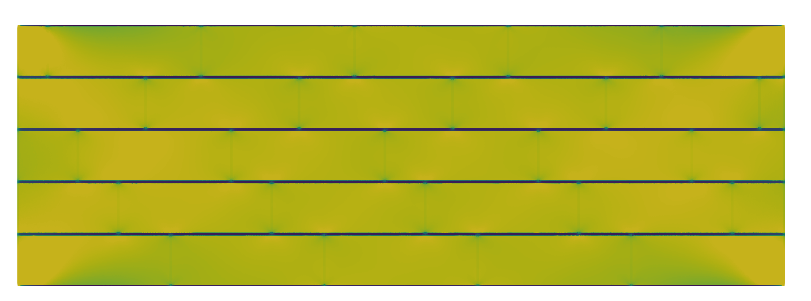
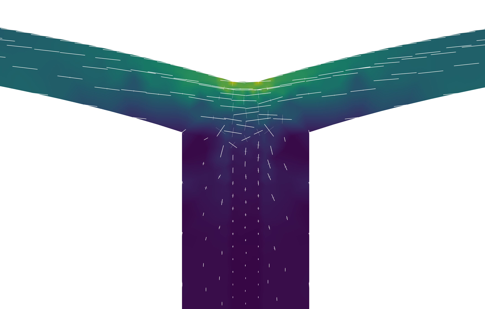
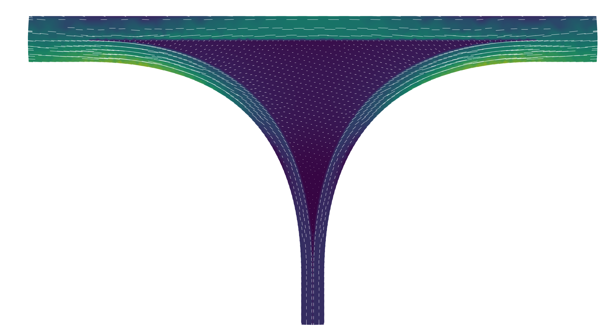

# 2D-Finite Element Modeling (FEM) of hypocotyl epidermal cells

Özer Erguvan, Adrien Heymans, Asal Atakhani, Elsa Gascone, Olivier Ali, Stéphane Verger.

This repository contains a Finite Element Model (FEM) of hypocotyl epidermal cells. The FEM framework uses the [bvpy](https://gitlab.inria.fr/mosaic/bvpy) library, and the mesh generation is performed with [GMSH](https://gmsh.info/).

## Repository content

Finite Element Method (FEM) analysis of stress and strain distribution in 2D models of the hypocotyl epidermis under varied Young's modulus conditions:

- 2D mesh representing the surface of a hypocotyl epidermis with staggered cell files, segmented into two subdomains: the cell and the interface between cells.
- 2D mesh of the hypocotyl longitudinal section with two subdomains: the cell wall and the adhesive layer at the interface.
- 2D mesh of the hypocotyl longitudinal section with four subdomains: the Supracellular Outer Epidermal Wall (SOEW), the Outer Epidermal Edge Filling (OEEF), the Inner Walls, and the Middle Lamella (ML)

All python scripts can be run through a Jupyter Notebook.
The analysis of the results is done with a Rscript (OECW_analysis.R) and all ".xdmf" can be visualise with [paraview](https://www.paraview.org/)  

## Requirements

To run the FEM simulation, you will need the following:

- BvPy

```{bash}
git clone -b dev_gmsh https://gitlab.inria.fr/mosaic/bvpy.git
cd bvpy
mamba env create -f conda/env_OS.yaml -n bvpy-dev_gmsh
mamba activate bvpy-dev_gmsh
python setup.py develop --prefix=$CONDA_PREFIX
```
the recommended way is to use [Mamba](https://mamba.readthedocs.io/en/latest/installation/mamba-installation.html) to create a virtual environment and run the FEM script in it.


- [GMSH](https://gmsh.info/#Download)

### Surface mesh



### 2 bulged cells



### SOEW 



## Citation

preprint: ...almost ready...

meanwhile: Özer Erguvan, Adrien Heymans, Asal Atakhani, Elsa Gascone, Olivier Ali, Stéphane Verger. 2024. "Ultrastructural Characterization of Cell Adhesion in Plants"; Plant Computational Biology Workshop 2024


