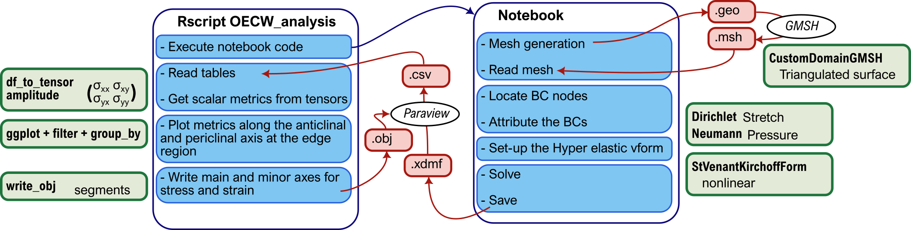

# 2D-Finite Element Modeling (FEM) of hypocotyl epidermal cells

Özer Erguvan, Adrien Heymans, Asal Atakhani, Elsa Gascon, Olivier Ali, Stéphane Verger.

## 1. About

This repository contains the Finite Element Modeling (FEM) analysis code used to explore stress and strain distribution in 2D representations of hypocotyl epidermal cells under varied mechanical conditions. Cell-cell adhesion plays a critical role in tissue integrity and controlled separation during development. Here, we investigate how adhesion mechanisms may vary under tension by simulating different subdomain Young's modulus configurations in the hypocotyl epidermis.

The FEM framework uses the [BvPy](https://gitlab.inria.fr/mosaic/bvpy), which is a python library, based on [FEniCS](https://fenicsproject.org/) and [GMSH](https://gmsh.info/).

The different study cases are:

- 2D mesh representing the surface of a hypocotyl epidermis with staggered cell files, segmented into two subdomains: the cell and the interface between cells.
- 2D mesh of a hypocotyl longitudinal section with two subdomains: the cell wall and the adhesive layer at the interface.
- 2D mesh of a hypocotyl longitudinal section with four subdomains: the Supracellular Outer Epidermal Wall (SOEW), the Outer Epidermal Edge Filling (OEEF), the Inner Walls, and the Middle Lamella (ML)

## 2. Install

We recommend to use [Mamba](https://mamba.readthedocs.io/en/latest/installation/mamba-installation.html) to create a virtual environment and run the FEM script in it ([Anaconda](https://www.anaconda.com/download) works also)

#### Requirements

- Python 3.9
- FEniCS 2019.1.0
- GMSH 4.11
- Bvpy-dev_gmsh
- Paraview 5.11.1
- R 4.3.1

### From Source:

```{bash}
git clone -b dev_gmsh https://gitlab.inria.fr/mosaic/bvpy.git
cd bvpy
mamba env create -f conda/env_OS.yaml -n bvpy-dev_gmsh
mamba activate bvpy-dev_gmsh
python setup.py develop --prefix=$CONDA_PREFIX
```

### From mamba/conda

```{bash}
mamba env create -f conda/environment.yaml
mamba activate bvpy-dev_gmsh
```

## 3. Usage and Repository content

FEM analysis of stress and strain distribution in 2D models of the hypocotyl epidermis under varied Young's modulus conditions. We tested our hypothesis in three different configurations:

- 2D mesh representing the surface of a hypocotyl epidermis with staggered cell files, segmented into two subdomains: the cell and the interface between cells.
- 2D mesh of a hypocotyl longitudinal section with two subdomains: the cell wall and the adhesive layer at the interface.
- 2D mesh of a hypocotyl longitudinal section with four subdomains: the Supracellular Outer Epidermal Wall (SOEW), the Outer Epidermal Edge Filling (OEEF), the Inner Walls, and the Middle Lamella (ML)

The analysis can be coducted with the Rscript (OECW_analysis.R) and all ".xdmf" can be visualise with [paraview](https://www.paraview.org/).

Indepenantly, all python scripts can be run through Jupyter Notebook.



### Surface mesh

Stress distribution on the epidermis surface if interfaces are stiffer than the cell domains


### 2 bulged cells

Stress distribution in the edge region of a longitudinal section of epidermal cells if interface is softer than the cell wall domains


### 2 cells with a Supracellular Outer Epidermal Wall

Stress-strain distribution in the edge region of a longitudinal section of epidermal cells if:

- all cell wall subdomain have uniform mechanical properties
- the Middle Lamella is softer than the other cell wall domains
- the Outer Epidermal Edge Filling is softer than the other cell wall domains
- the Supracellular Outer Epidermal Wall is softer than the other cell wall domains
- the SOEW and OEEF are softer than the other cell wall domains

Stress distribution in the edge region of a longitudinal section of epidermal cells if Outer Epidermal Edge Filling is softer than the other cell wall domains


## Citation

cite the preprint as soon as it is out.
Meanwhile:

>  Özer Erguvan, Adrien Heymans, Asal Atakhani, Elsa Gascon, Olivier Ali, Stéphane Verger. 2024. "Ultrastructural Characterization of Cell Adhesion in Plants"; Plant Computational Biology Workshop 2024


